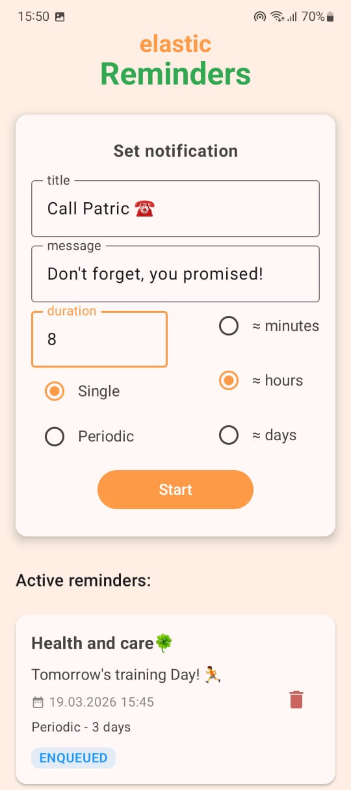
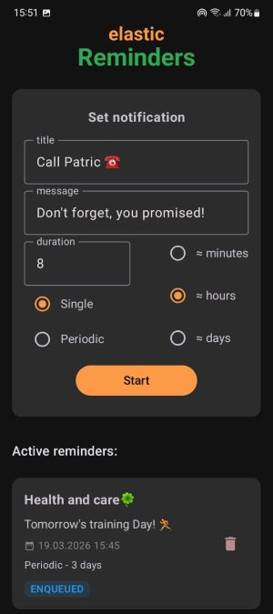

Elastic Reminders ⏰

Description:
A modern Android application for task management with smart, flexible reminders. Built using Clean Architecture to ensure a scalable and maintainable codebase.

🛠 Tech Stack

    Language: Kotlin

    Architecture: Clean Architecture (MVVM)

    UI: Jetpack Compose

    Data: Room Database

    Background Tasks: WorkManager

    Concurrency: Coroutines & Flow

🚀 Key Features

    Custom Reminders: Create reminders with titles, descriptions, and flexible timing.

    Flexible Scheduling: Configure reminders as one-time or periodic (using minutes, hours, or days).

    Reliable Delivery: Uses WorkManager for guaranteed background execution.

    Offline-First: All data is managed locally via Room.

🏗 Architecture

The app follows a clean separation of concerns:

    Data Layer: Contains repository interfaces and handles Room database operations.

    Ui Layer: Reactive UI built with Jetpack Compose and ViewModel.

📸 Screenshots

| Light Theme | Dark Theme |
| :---: | :---: |
|  |  |
